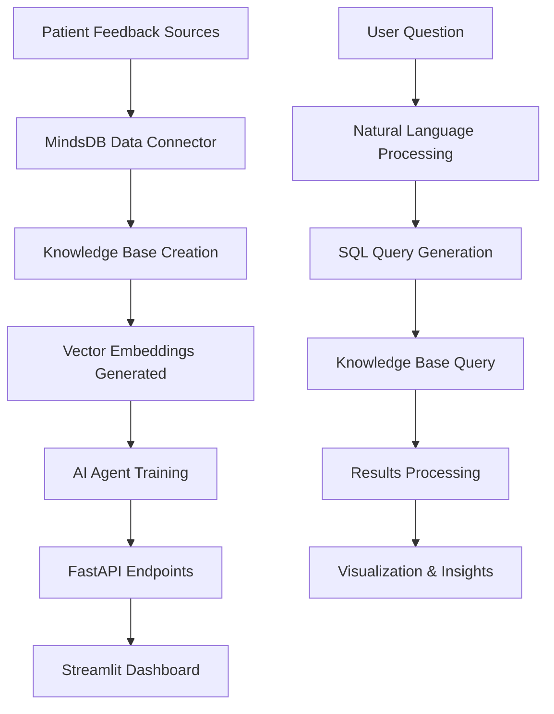

# 🏥 MediQuery — AI-Powered Medical Analytics & Insights Platform

[](https://python.org)
[](https://fastapi.tiangolo.com)
[](https://streamlit.io)
[](https://mindsdb.com)

MediQuery is an intelligent healthcare analytics copilot that transforms natural language questions into actionable medical insights. Built on MindsDB's AI infrastructure, it enables hospitals, clinics, and researchers to analyze patient feedback, satisfaction surveys, and treatment effectiveness without writing complex SQL queries.

Team / Function - Customer/ Support
Healthcare and Life Sciences -Patient feedback

## � Probledm Statement

### The Healthcare Analytics Challenge

Healthcare organizations collect vast amounts of patient feedback data but struggle to extract actionable insights due to:

**🔍 Data Accessibility Issues:**
- Patient feedback scattered across multiple systems (surveys, reviews, forms)
- Technical barriers preventing non-technical staff from accessing insights
- Time-consuming manual analysis of unstructured text data

**📊 Analysis Limitations:**
- Traditional BI tools require SQL expertise and technical training
- Static dashboards don't answer ad-hoc questions from clinical staff
- Semantic search capabilities missing for finding relevant patient experiences

**⏱️ Operational Inefficiencies:**
- Hours spent manually categorizing and analyzing patient feedback
- Delayed identification of satisfaction trends and quality issues
- Inability to quickly correlate patient sentiment with operational metrics

### The MediQuery Solution

MediQuery solves these challenges by providing:

- **Natural Language Interface** — Ask questions in plain English, get instant insights
- **Semantic Search** — Find relevant patient experiences using context, not just keywords  
- **Real-time Analytics** — Live insights from streaming patient feedback data
- **Zero Technical Barrier** — Clinicians and administrators can analyze data without SQL knowledge
- **Automated Categorization** — AI-powered classification of feedback themes and sentiment

### Use Cases Solved

1. **Quality Improvement Teams** — Identify satisfaction trends and improvement opportunities
2. **Department Managers** — Monitor departmental performance and patient experience metrics
3. **Clinical Leadership** — Understand patient sentiment around specific treatments or procedures
4. **Patient Experience Officers** — Track NPS scores and satisfaction drivers across the organization
5. **Researchers** — Analyze patient outcomes and treatment effectiveness from feedback data

## ✨ Key Features

- **🤖 Conversational AI Agent** — Natural language to SQL query transformation
- **🧠 Semantic Knowledge Base** — Intelligent search through patient feedback with context understanding
- **📊 Real-time Analytics** — Live insights from patient satisfaction surveys and reviews
- **🔍 Metadata-Aware Filtering** — Filter by department, patient type, date ranges, and more
- **⚡ Zero-ETL Architecture** — Works directly with live data sources (Google Sheets, databases)
- **🎯 Interactive Dashboard** — User-friendly Streamlit interface with charts and visualizations
- **🔌 RESTful API** — FastAPI backend for easy integration with existing systems


## Sample queries 

1) What is the average patient satisfaction by department, and which departments have the lowest treatment effectiveness ratings?

2) For cardiology patients with low treatment effectiveness ratings, what other complaints appear in their feedback?

3) How does wait time correlate with patient recommendations across all departments?

4) Which department has the best doctor communication?

## 🏗️ System Architecture

### High-Level Architecture

```
┌─────────────────────────────────────────────────────────────┐
│                    DATA INGESTION LAYER                     │
├─────────────────┬─────────────────┬─────────────────────────┤
│  Google Sheets  │   PostgreSQL    │    Survey APIs          │
│  Patient Forms  │   EMR Systems   │    Review Platforms     │
└─────────────────┴─────────────────┴─────────────────────────┘
                            │
                    ┌───────▼────────┐
                    │  MindsDB Core  │
                    │   Data Layer   │
                    └───────┬────────┘
                            │
        ┌───────────────────┼───────────────────┐
        │                   │                   │
┌───────▼────────┐ ┌────────▼────────┐ ┌───────▼────────┐
│ Knowledge Base │ │   AI Agents     │ │  Data Sources  │
│ (Embeddings)   │ │ (NL→SQL)        │ │  (Live Sync)   │
│                │ │                 │ │                │
│ • Semantic     │ │ • Question      │ │ • Real-time    │
│   Search       │ │   Processing    │ │   Updates      │
│ • Vector DB    │ │ • SQL Gen       │ │ • Schema       │
│ • Metadata     │ │ • Context       │ │   Detection    │
└───────┬────────┘ └────────┬────────┘ └───────┬────────┘
        │                   │                   │
        └───────────────────┼───────────────────┘
                            │
                    ┌───────▼────────┐
                    │  REST SQL API  │
                    │ (MindsDB HTTP) │
                    └───────┬────────┘
                            │
                    ┌───────▼────────┐
                    │ FastAPI Backend│
                    │                │
                    │ • /ask_agent   │
                    │ • /kb_search   │
                    │ • /raw_sql     │
                    │ • /health      │
                    └───────┬────────┘
                            │
                    ┌───────▼────────┐
                    │ Streamlit UI   │
                    │                │
                    │ • Chat Interface│
                    │ • Visualizations│
                    │ • Filters      │
                    │ • Export       │
                    └────────────────┘
```

### Component Details

#### 1. Data Ingestion Layer
- **Multiple Sources**: Google Sheets, databases, APIs, file uploads
- **Real-time Sync**: Automated data pipeline with configurable intervals
- **Schema Detection**: Automatic column mapping and data type inference

#### 2. MindsDB AI Layer
- **Knowledge Base**: Vector embeddings for semantic search
- **AI Agents**: Natural language to SQL query translation
- **Model Management**: Support for multiple LLM providers (OpenAI, Google, Anthropic)

#### 3. Application Layer
- **FastAPI Backend**: RESTful API with async processing
- **Streamlit Frontend**: Interactive dashboard with real-time updates
- **Authentication**: Role-based access control (future enhancement)

#### 4. Data Flow



## 🚀 Quick Start

### Prerequisites

- Python 3.8+
- MindsDB instance (local or cloud)
- Git

### 1. Clone the Repository

```bash
git clone https://github.com/yourusername/medquery.git
cd medquery
```

### 2. Set Up Virtual Environment

```bash
python -m venv .venv

# On Windows
.venv\Scripts\activate

# On macOS/Linux
source .venv/bin/activate
```

### 3. Install Dependencies

```bash
# Backend dependencies
cd backend
pip install -r requirements.txt

# Frontend dependencies
cd ../frontend
pip install -r requirements.txt
```

### 4. Configure Environment

```bash
# Copy and edit backend environment file
cd ../backend
cp .env .env.local
```

Edit `.env.local` with your MindsDB configuration:

```env
MINDSDB_URL=http://localhost:47334
MINDSDB_API_KEY=your_api_key_if_needed
```

### 5. Start the Services

**Terminal 1 - Backend:**
```bash
cd backend
uvicorn main:app --reload
```

**Terminal 2 - Frontend:**
```bash
cd frontend
streamlit run app.py
```

### 6. Access the Application

- 🖥️ **Frontend Dashboard**: http://localhost:8501
- 🔧 **Backend API**: http://localhost:8000
- 📚 **API Documentation**: http://localhost:8000/docs

## 📋 MindsDB Setup

### 1. Create Data Source

Connect your patient feedback data (Google Sheets example):

```sql
CREATE DATABASE patient_feedback_source
WITH ENGINE = 'sheets',
PARAMETERS = {
    "spreadsheet_id": "your_google_sheet_id",
    "sheet_name": "patient_reviews"
};
```

### 2. Create Knowledge Base

Set up semantic search capabilities:

```sql
CREATE KNOWLEDGE_BASE patient_reviews_kb
USING
    embedding_model = {
        "provider": "google",
        "model_name": "text-embedding-004"
    },
    reranking_model = {
        "provider": "google", 
        "model_name": "gemini-2.5-flash"
    },
    metadata_columns = [
        "patient_id", "department", "visit_date", 
        "patient_type", "overall_rating", "doctor_communication",
        "cleanliness", "wait_time", "treatment_effectiveness",
        "recommendation", "verified"
    ],
    content_columns = ["review_text"],
    id_column = "review_id";
```

### 3. Create AI Agent

Configure the conversational analytics agent:

```sql
CREATE AGENT department_analysis
USING
    model = {
        "provider": "google",
        "model_name": "gemini-2.5-flash"
    },
    data = {
        "tables": ["mindsdb.patient_reviews_kb"]
    },
    prompt_template = 'You have access to patient_reviews_kb with columns: department, overall_rating, treatment_effectiveness, doctor_communication, wait_time, recommendation. Analyze satisfaction trends, detect concerns, and summarize outcomes by department.';
```

### 4. Set Up Auto-Sync (Optional)

Keep your knowledge base updated automatically:

```sql
CREATE JOB sync_patient_reviews (
    INSERT INTO patient_reviews_kb
    SELECT * FROM patient_feedback_source.patient_reviews
    WHERE review_id NOT IN (
        SELECT id FROM patient_reviews_kb
    )
) EVERY 6 hours;
```
ent
SELECT answer FROM department_analysis 
WHERE question = 'What is the average patient satisfaction by department? Include sample size and standard deviation.';

-- Identify underperforming departments
SELECT answer FROM department_analysis 
WHERE question = 'Which departments have ratings below 3.5 and what are the main complaint categories?';

-- Trend analysis
SELECT answer FROM department_analysis 
WHERE question = 'How has patient satisfaction changed over the last 6 months by department?';
```

#### 2. Operational Insights

```sql
-- Wait time correlation with satisfaction
SELECT answer FROM department_analysis 
WHERE question = 'What is the correlation between wait times and overall satisfaction scores?';

-- Peak complaint analysis
SELECT answer FROM department_analysis 
WHERE question = 'What are the top 5 complaint categories and which departments have the highest frequency?';

-- Staff performance insights
SELECT answer FROM department_analysis 
WHERE question = 'Compare doctor communication sform ses nurse care scores across all departments.';
```

#### 3. Patient Experience Deep Dive

```sql
-- Sentiment analysis by patient type
SELECT maswer FROM depntic searcheysis 
WHERE question = 'Compare sentiment scores between inpaties:d outpatient experiences.';

-- Recommendation drivers
SELECT answer FROM department_analysis 
WHERE question = 'What factors most strongly predict whether a patient will recomme hospital?';

-- Pain management effectiveness
SELECT answer FRent_analysis 
WHERE question = 'Which departments have the highest pain management scores and what do patients sbout it?';
```

### Knowledge Base Search Examples

#### 1. Semantic Search Queries

```sql
-- Find positive communication experiences
SELECT review_text, department, doctor_communicationrity_score
FROM mindsdb.patient_reviews_kb 
WHERE content = 'excellent doctor communication and clear explanations'
AND doctor_communication >= 4
ORDER BY similarity_score DESC
LIMIT 15;

-- Identify cleanliness concerns
SELECT review_text, department, cleanliness, visit_date, similarity_score
FROM mindsdb.patient_reviews_kb 
WHERE content = 'dirty rooms unclean facilities hygiene issues'
AND cleanliness <= 2
ORDER BY visit_date DESC
LIMIT 20;

-- Emergency department specific feedback
SELECT review_text, wait_time_minutes, overall_rating, similarity_score
FROM mindsdb.patient_reviews_kb 
WHERE content = 'emergency room wait time urgent care'
AND department = 'Emergency'
AND wait_time_minutes > 60
ORDER BY similarity_score DESC;
```

#### 2. Multi-Filter Analysis

```sql
-- High-satisfaction cardiology patients
SELECT review_text, doctor_communication, treatment_effectiveness, 
       age_group, insurance_type, similarity_score
FROM mindsdb.patient_reviews_kb 
WHERE content = 'heart treatment cardiac care excellent outcome'
AND department = 'Cardiology'
AND overall_rating >= 4
AND treatment_effectiveness >= 4
ORDER BY similarity_score DESC
LIMIT 10;

-- Pain management concerns by department
SELECT department, review_text, pain_management, 
       treatment_effectiveness, similarity_score
FROM mindsdb.patient_reviews_kb 
WHERE content = 'pain not managed medication ineffective still hurting'
AND pain_management <= 2
GROUP BY department
ORDER BY department, similarity_score DESC;
```

#### 3. Temporal and Demographic Analysis

```sql
-- Recent feedback trends
SELECT department, AVG(overall_rating) as avg_rating, 
       COUNT(*) as review_count,
       AVG(sentiment_score) as avg_sentiment
FROM mindsdb.patient_reviews_kb 
WHERE visit_date >= '2024-01-01'
GROUP BY department
ORDER BY avg_rating DESC;

-- Age group satisfaction patterns
SELECT age_group, department, 
       AVG(overall_rating) as satisfaction,
       AVG(wait_time_minutes) as avg_wait,
       COUNT(*) as sample_size
FROM mindsdb.pati_kb 
WHERE verified = true
GROUP BY age_group, department
HAVING sample_size >= 10
ORDER BY age_group, satisfaction DESC;

-- Insurance type impact analysis
SELECT insurance_type, 
       AVG(overall_rating) as avg_satisfaction,
       AVG(appointment_scheduling) as scheduling_ease,
       AVG(wait_time_minutes) as avg_wait_time,
       COUNT(*) as total_reviews
FROM mindsdb.patient_reviews_kb 
WHERE visit_date >= '2024-01-01'
GROUP BY insurance_type
ORDER BY avg_satisfaction DESC;
```

### Advanced Analyticseries

#### 1. Correlation Analysis

```sql
-- Multi-factor correlation with recommendation likelihood
SELECT 
    CORR(doctor_communication, return_likelihood) as doc_comm_correlation,
    CORR(cleanliness, return_likelihood) as cleanliness_correlation,
    CORR(wait_time_minutes, return_likelihood) as wait_time_correlation,
    CORR(treatment_effectiveness, return_likelihood) as treatment_correlation
FROM mindsdb.patient_reviews_kb 
WHERE verified = true;
```

#### 2. Predictive Insights

```sql
-- Identify at-risk satisfaction scores
SELECT answer FROM department_analysis 
WHERE question = 'Based on current trends, which departments are likely to see declining satisfaction in the next quarter?';

-- Improvement opportunity identification
SELECT answer FROM department_analysis 
WHERE question = 'What are the top 3 improvement opportunities that would have the biggest impact on overall satisfaction?';
```

```sql
SELECT review_text, department, similarity_score
FROM mindsdb.patient_reviews_kb 
WHERE content = 'excellent doctor communication and clean facilities'
AND department = 'Cardiology'
LIMIT 10;
```

## 🛠️ API Reference

### POST `/ask_agent`

Query the AI agent with natural language:

```json
{
    "agent_name": "department_analysis",
    "question": "What is the average patient satisfaction by department?"
}
```

### POST `/kb_search`

Perform semantic search on the knowledge base:

```json
{
    "kb_full_name": "project.patient_reviews_kb",
    "query_text": "excellent doctor communication",
    "limit": 10,
    "metadata_filters": {
        "department": "Cardiology"
    }
}
```

### GET `/health`

Check service health and configuration:

```json
{
    "status": "ok",
    "mindsdb_url": "http://localhost:47334"
}
```

## 📊 Knowledge Base Schema

### Core Patient Feedback Schema

The MediQuery Knowledge Base is designed to handle comprehensive patient feedback data with the following structure:

#### Primary Data Table: `patient_reviews`

| Column | Type | Constraints | Description |
|--------|------|-------------|-------------|
| `review_id` | VARCHAR(50) | PRIMARY KEY | Unique identifier for each review |
| `patient_id` | VARCHAR(50) | NOT NULL | Anonymized patient identifier |
| `department` | VARCHAR(100) | NOT NULL | Hospital department (Cardiology, Emergency, etc.) |
| `visit_date` | DATE | NOT NULL | Date of patient visit |
| `submission_date` | TIMESTAMP | DEFAULT NOW() | When feedback was submitted |
| `patient_type` | VARCHAR(50) | | Inpatient, Outpatient, Emergency |
| `age_group` | VARCHAR(20) | | 18-30, 31-50, 51-70, 70+ |
| `insurance_type` | VARCHAR(50) | | Private, Medicare, Medicaid, Self-Pay |

#### Rating Metrics (1-5 Scale)

| Column | Type | Range | Description |
|--------|------|-------|-------------|
| `overall_rating` | INTEGER | 1-5 | Overall satisfaction score |
| `doctor_communication` | INTEGER | 1-5 | Physician communication quality |
| `nurse_care` | INTEGER | 1-5 | Nursing staff care quality |
| `cleanliness` | INTEGER | 1-5 | Facility cleanliness rating |
| `treatment_effectiveness` | INTEGER | 1-5 | Perceived treatment success |
| `pain_management` | INTEGER | 1-5 | Pain management effectiveness |
| `discharge_process` | INTEGER | 1-5 | Discharge experience rating |

#### Operational Metrics

| Column | Type | Unit | Description |
|--------|------|------|-------------|
| `wait_time_minutes` | INTEGER | Minutes | Total wait time |
| `appointment_scheduling` | INTEGER | 1-5 | Ease of scheduling |
| `facility_navigation` | INTEGER | 1-5 | Ease of finding locations |
| `parking_availability` | INTEGER | 1-5 | Parking convenience |

#### Text and Categorical Data

| Column | Type | Description |
|--------|------|-------------|
| `review_text` | TEXT | Free-form patient feedback |
| `complaint_category` | VARCHAR(100) | Auto-categorized complaint type |
| `sentiment_score` | DECIMAL(3,2) | -1.0 to 1.0 sentiment analysis |
| `language` | VARCHAR(10) | Review language (en, es, fr, etc.) |
| `recommendation` | BOOLEAN | Would recommend to others |
| `return_likelihood` | INTEGER | 1-5 scale likelihood to return |
| `verified` | BOOLEAN | Verified patient status |

### Knowledge Base Configuration

```sql
-- Knowledge Base with comprehensive metadata indexing
CREATE KNOWLEDGE_BASE patient_reviews_kb
USING
    embedding_model = {
        "provider": "google",
        "model_name": "text-embedding-004"
    },
    reranking_model = {
        "provider": "google", 
        "model_name": "gemini-2.5-flash"
    },
    -- Searchable metadata for filtering
    metadata_columns = [
        "patient_id", "department", "visit_date", "submission_date",
        "patient_type", "age_group", "insurance_type",
        "overall_rating", "doctor_communication", "nurse_care",
        "cleanliness", "treatment_effectiveness", "pain_management",
        "wait_time_minutes", "complaint_category", "sentiment_score",
        "recommendation", "return_likelihood", "verified"
    ],
    -- Text content for semantic search
    content_columns = ["review_text"],
    -- Unique identifier
    id_column = "review_id";
```

### Sample Data Structure

```json
{
    "review_id": "REV_2024_001234",
    "patient_id": "PAT_ANON_5678",
    "department": "Cardiology",
    "visit_date": "2024-01-15",
    "submission_date": "2024-01-16T10:30:00Z",
    "patient_type": "Outpatient",
    "age_group": "51-70",
    "insurance_type": "Private",
    "overall_rating": 4,
    "doctor_communication": 5,
    "nurse_care": 4,
    "cleanliness": 4,
    "treatment_effectiveness": 5,
    "pain_management": 3,
    "discharge_process": 4,
    "wait_time_minutes": 25,
    "appointment_scheduling": 4,
    "facility_navigation": 3,
    "parking_availability": 2,
    "review_text": "Dr. Smith was excellent in explaining my condition and treatment options. The nursing staff was very caring. However, parking was difficult to find and I had to walk quite far.",
    "complaint_category": "Parking/Access",
    "sentiment_score": 0.65,
    "language": "en",
    "recommendation": true,
    "return_likelihood": 4,
    "verified": true
}

## 🔧 Tech Stack

| Layer | Technology |
|-------|------------|
| **AI Engine** | MindsDB Agents + Knowledge Bases |
| **LLM** | Google Gemini 2.5 Flash |
| **Embeddings** | Google text-embedding-004 |
| **Backend** | FastAPI + Python |
| **Frontend** | Streamlit |
| **Data Sources** | Google Sheets, PostgreSQL, MySQL |
| **Deployment** | Docker, Uvicorn |

## 📈 Key Performance Metrics & Analytics

### Patient Satisfaction Metrics

#### Core Satisfaction KPIs

| Metric | Calcisfaction Targe** | `AVG(overall_rating)` | 4.0 - 5.0 | Primary satisfaction indicator |
| **Net Promoter Score (NPS)** | `(% Promoters - % Detractors)` | 50+ | Likelihood to recommend |
| **Patient Retention Rate** | `AVG(return_likelihood)` | 4.0+ | Willingness to return |
| **Satisfaction Trend** | `Month-over-month % change` | Positive | Satisfaction trajectory |

#### Departmental Performance Metrics

```sql
-- Department satisfaction dashboard
SELECT 
    department,
    AVG(overall_rating) as avg_satisfaction,
    COUNT(*) as total_reviews,
    STDDEV(overall_rating) as satisfaction_variance,
    AVG(CASE WHEN overall_rating >= 4 THEN 1 ELSE 0 END) * 100 as satisfaction_rate,
    AVG(sentiment_score) as avg_sentiment
FROM mindsdb.patient_reviews_kb 
WHERE visit_date >= DATE_SUB(NOW(), INTERVAL 3 MONTH)
GROUP BY department
ORDER BY avg_satisfaction DESC;
```

### Operational Excellence Metrics

#### Service Quality Indicators

| Metric | SQL Query | Benchmark | Impact |
|--------|-----------|-----------|---------|
| **Average Wait Time** | `AVG(wait_time_minutes)` | < 30 min | Patient experience |
| **Communication Quality** | `AVG(doctor_communication)` | > 4.2 | Trust & satisfaction |
| **Cleanliness Standards** | `AVG(cleanliness)` | > 4.0 | Safety perception |
| **Treatment Effectiveness** | `AVG(treatment_effectiveness)` | > 4.0 | Clinical outcomes |

#### Complaint Analysis Metrics

```sql
-- Top complaint categories with impact assessment
SELECT 
    complaint_category,
    COUNT(*) as frequency,
    AVG(overall_rating) as avg_rating_with_complaint,
    AVG(sentiment_score) as avg_sentiment,
    (COUNT(*) * 100.0 / (SELECT COUNT(*) FROM patient_reviews_kb)) as percentage_of_total
FROM mindsdb.patient_reviews_kb 
WHERE complaint_category IS NOT NULL
GROUP BY complaint_category
ORDER BY frequency DESC
LIMIT 10;
```

### Patient Demographics & Segmentation

#### Satisfaction by Patient Segments

```sql
-- Patient segment performance analysis
SELECT 
    patient_type,
    age_group,
    insurance_type,
    AVG(overall_rating) as satisfaction,
    AVG(wait_time_minutes) as avg_wait,
    COUNT(*) as segment_size,
    AVG(CASE WHEN recommendation = true THEN 1 ELSE 0 END) * 100 as recommendation_rate
FROM mindsdb.patient_reviews_kb 
GROUP BY patient_type, age_group, insurance_type
HAVING segment_size >= 20
ORDER BY satisfaction DESC;
```

### Real-Time Monitoring Metrics

#### Alert Thresholds

| Alert Type | Condition | Threshold | Action Required |
|------------|-----------|-----------|-----------------|
| **Satisfaction Drop** | `AVG(overall_rating) < 3.5` | Department level | Immediate review |
| **High Wait Times** | `AVG(wait_time_minutes) > 60` | Daily average | Staffing adjustment |
| **Complaint Spike** | `COUNT(complaints) > baseline + 2σ` | Weekly comparison | Root cause analysis |
| **Low NPS** | `NPS < 30` | Monthly calculation | Service improvement plan |

#### Trending Analysis

```sql
-- Monthly satisfaction trends with statistical significance
WITH monthly_stats AS (
    SELECT 
        DATE_FORMAT(visit_date, '%Y-%m') as month,
        department,
        AVG(overall_rating) as avg_rating,
        COUNT(*) as sample_size,
        STDDEV(overall_rating) as std_dev
    FROM mindsdb.patient_reviews_kb 
    WHERE visit_date >= DATE_SUB(NOW(), INTERVAL 12 MONTH)
    GROUP BY DATE_FORMAT(visit_date, '%Y-%m'), department
)
SELECT 
    month,
    department,
    avg_rating,
    sample_size,
    LAG(avg_rating) OVER (PARTITION BY department ORDER BY month) as prev_month_rating,
    (avg_rating - LAG(avg_rating) OVER (PARTITION BY department ORDER BY month)) as month_over_month_change
FROM monthly_stats
ORDER BY department, month;
```

### Predictive Analytics Metrics

#### Risk Indicators

```sql
-- Patient satisfaction risk scoring
SELECT 
    department,
    AVG(CASE 
        WHEN wait_time_minutes > 45 AND doctor_communication < 4 THEN 1 
        ELSE 0 
    END) * 100 as high_risk_percentage,
    AVG(CASE 
        WHEN overall_rating <= 2 THEN 1 
        ELSE 0 
    END) * 100 as detractor_rate,
    COUNT(*) as total_encounters
FROM mindsdb.patient_reviews_kb 
WHERE visit_date >= DATE_SUB(NOW(), INTERVAL 1 MONTH)
GROUP BY department
ORDER BY high_risk_percentage DESC;
```

### Business Impact Metrics

#### ROI and Value Metrics

| Business Metric | Calculation Method | Expected Impact |
|-----------------|-------------------|-----------------|
| **Patient Retention Value** | `Retention Rate × Average Patient Value` | Revenue protection |
| **Referral Generation** | `NPS Score × Patient Volume × Referral Rate` | New patient acquisition |
| **Operational Efficiency** | `Satisfaction Score ÷ Cost per Patient` | Resource optimization |
| **Quality Improvement ROI** | `(Satisfaction Increase × Patient Volume × LTV)` | Investment justification |

#### Performance Benchmarking

```sql
-- Comparative performance analysis
SELECT 
    department,
    AVG(overall_rating) as current_satisfaction,
    (SELECT AVG(overall_rating) FROM patient_reviews_kb WHERE visit_date BETWEEN DATE_SUB(NOW(), INTERVAL 2 YEAR) AND DATE_SUB(NOW(), INTERVAL 1 YEAR)) as baseline_satisfaction,
    AVG(overall_rating) - (SELECT AVG(overall_rating) FROM patient_reviews_kb WHERE visit_date BETWEEN DATE_SUB(NOW(), INTERVAL 2 YEAR) AND DATE_SUB(NOW(), INTERVAL 1 YEAR)) as improvement,
    RANK() OVER (ORDER BY AVG(overall_rating) DESC) as satisfaction_rank
FROM mindsdb.patient_reviews_kb 
WHERE visit_date >= DATE_SUB(NOW(), INTERVAL 1 YEAR)
GROUP BY department;
```

## 🔮 Roadmap

- [ ] **Multi-Agent Collaboration** — Complex medical insights through agent coordination
- [ ] **Advanced Analytics Dashboard** — Trend analysis and correlation detection  
- [ ] **Real-time Alerts** — Automated notifications for satisfaction drops
- [ ] **Mobile App** — iOS/Android companion app
- [ ] **Integration APIs** — Connect with EMR systems (Epic, Cerner)
- [ ] **Multi-language Support** — Analyze feedback in multiple languages
- [ ] **Predictive Analytics** — ML models for satisfaction prediction
| -----*Integr---------|---— Connect w|------ systems (Epic, Cerner)
- [ ] **Multi-language Support** — Analyze feedback in multiple languages
- [ ] **Predictive Analytics** — ML models for satisfaction prediction

## 🙏 Acknowledgments

- [MindsDB](https://mindsdb.com) for the AI infrastructure
- [FastAPI](https://fastapi.tiangolo.com) for the excellent web framework
- [Streamlit](https://streamlit.io) for the rapid UI development
- The healthcare analytics community for inspiration and feedback

---
Blog (Linkdin) - https://www.linkedin.com/posts/gaurav-pawar-aa8a93276_healthtech-aiinnovation-dataanalytics-activity-7390175466189467648-eWDf?utm_source=social_share_send&utm_medium=android_app&rcm=ACoAAENvi2ABqh05Qp5FWolONL1Tukg9GTg_FU0&utm_campaign=whatsapp

Youtube Video - https://youtu.be/dwu381WvOak?si=vCQL_zTXTmKW7At4 

twitter link - https://x.com/pawar_gaur1214/status/1984415724568527284
**Made with ❤️ for better healthcare analytics**